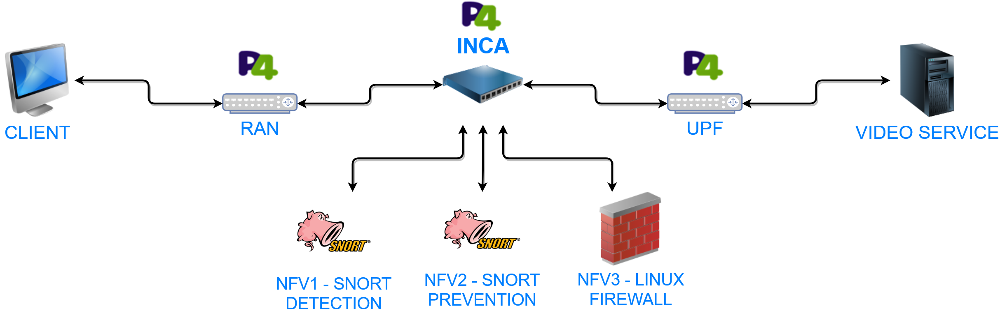

# Service Function Chaining topology for INCA

This repository builds an SFC topology to be used with INCA. The complete topology is as shown below. Note that RAN and UPF are part of [another repository](https://github.com/guimvmatos/P4-BMv2-RAN-UPF), just like INCA.



To see the full work, visit [Project INCA page](https://github.com/guimvmatos/P4-INCA).

### Deployment

We built our testbed using [virtualbox](https://www.vagrantup.com/downloads.html) as hypervisor and [vagrant](https://www.vagrantup.com/downloads.html) as VM manager. Please make sure that you have them installed on your machine.

Each node is deployed as a Virtual machine (VM) and running Linux kernel.

Clone the git repository in your machine: 

```
$ git clone https://github.com/guimvmatos/Snort-SegmentRouting.git
```

Deploy the testbed:

```
$ cd Snort-SegmentRouting/
$ vagrant up 
$ vagrant provision
```

Using [iperf](https://iperf.fr/), we generate UDP traffic from Site A destined to Site with different destination port numbers (5000 and 6000 in this demo).